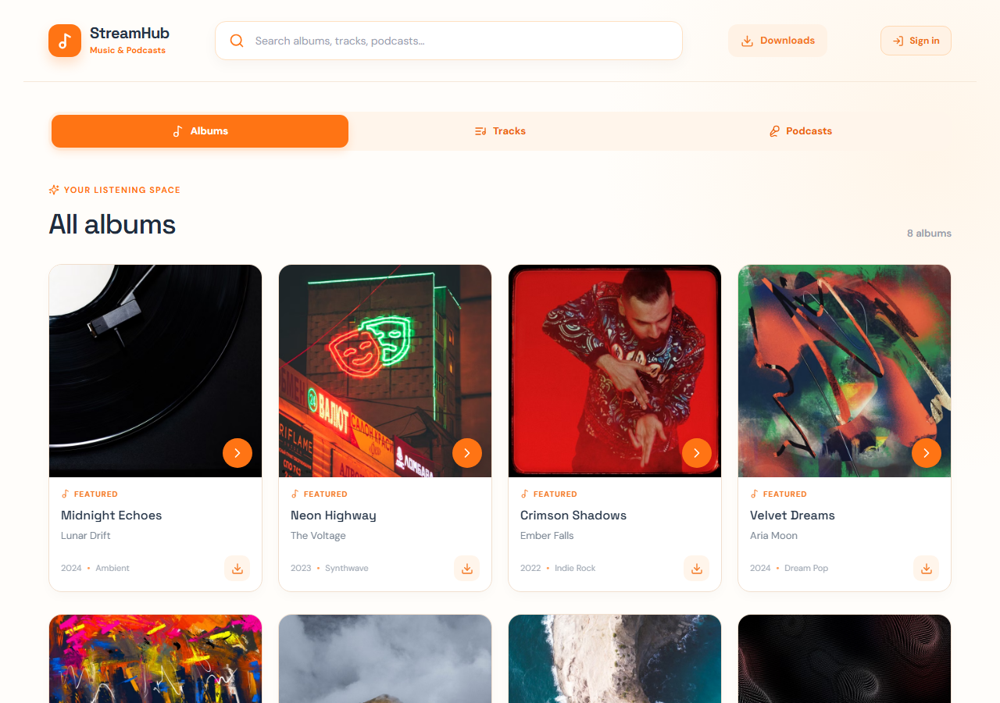
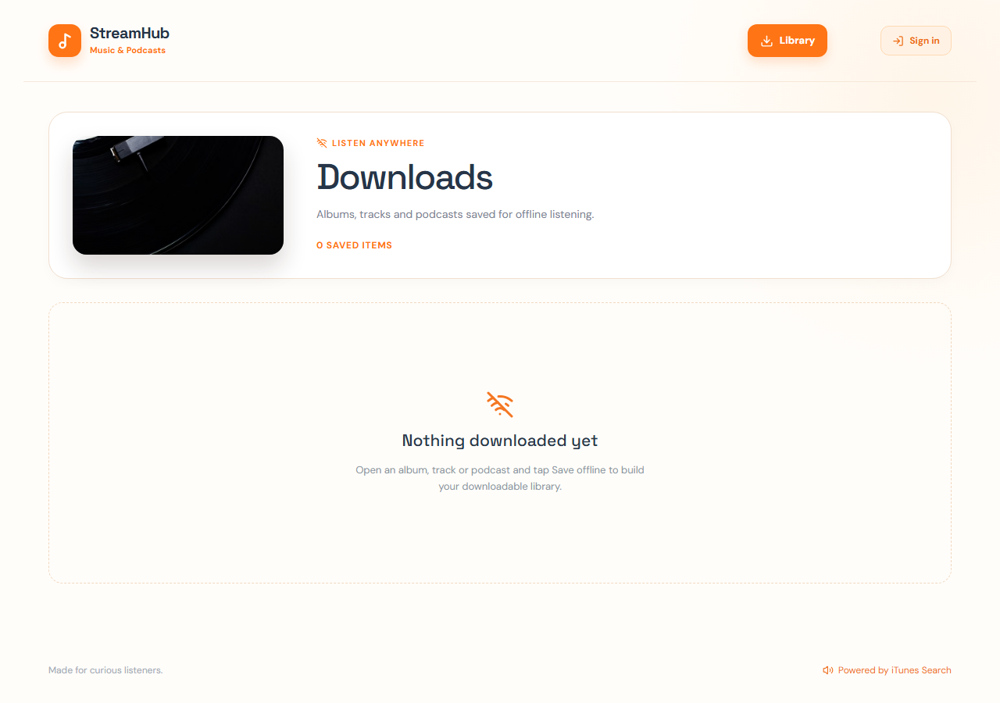
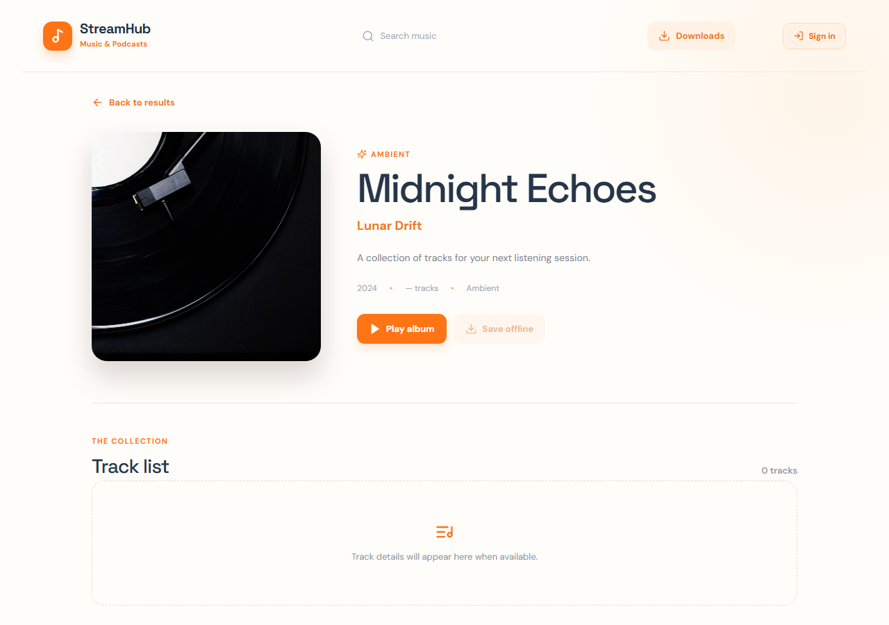
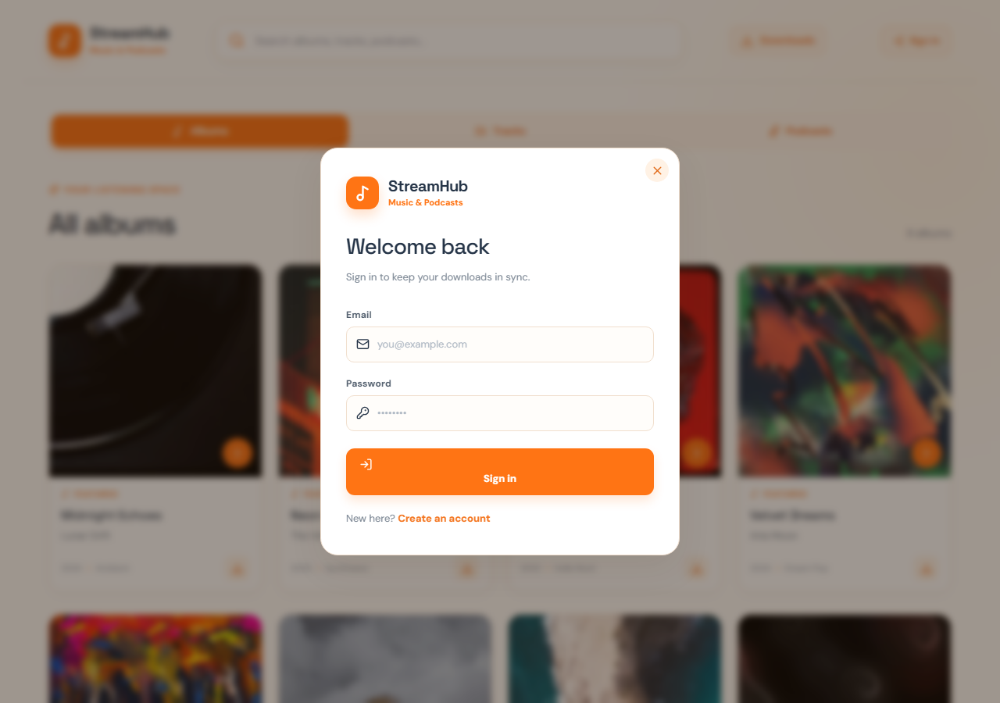

# StreamHub — Music & Podcasts

A modern web app for searching, streaming, and saving music albums, tracks, and podcasts for offline listening.



## Features

- **Search** — Instantly search albums, tracks, and podcasts via the iTunes Search API
- **Album detail** — View full track lists with play/pause and one-click save
- **Mini player** — Persistent bottom player bar across all views
- **Downloads** — Save albums, tracks, or podcast episodes for offline playback (cached via IndexedDB)
- **Podcast feeds** — Load any podcast's RSS feed to browse and save individual episodes
- **User accounts** — Optional Supabase Auth sign-up/sign-in for syncing
- **PWA** — Installable on iOS/Android home screens with offline app-shell caching



## Tech Stack

| Layer | Technology |
|-------|-----------|
| Frontend | React 18, TypeScript, Vite, Tailwind CSS |
| Icons | Lucide React |
| Auth | Supabase Auth (email/password) |
| API proxy | Supabase Edge Function → iTunes Search API |
| Storage | localStorage (metadata) + IndexedDB (audio blobs) |
| Deployment | Netlify (static SPA + SPA fallback redirects) |
| Mobile | PWA (service worker + manifest) + Capacitor (iOS & Android shells) |





## Getting Started

```bash
# Clone
git clone https://github.com/YOUR_USERNAME/streamhub.git
cd streamhub

# Install dependencies
npm install

# Create .env
echo VITE_SUPABASE_URL=https://your-project.supabase.co > .env
echo VITE_SUPABASE_ANON_KEY=your-anon-key >> .env

# Start dev server
npm run dev
```

Open `http://localhost:5173` in your browser.

## Building

```bash
npm run build          # Output in dist/
npx cap sync android   # Sync to Android project
npx cap sync ios       # Sync to iOS project
```

## Deploying to Netlify

```bash
npx netlify deploy --dir dist --prod
```

## Project Structure

```
├── public/                  # Static assets (icons, manifest, service worker)
├── src/
│   ├── components/
│   │   ├── AuthPage.tsx     # Sign-in / Sign-up overlay
│   │   └── DownloadsPage.tsx # Offline library with feed parser
│   ├── lib/
│   │   ├── auth.ts          # Supabase Auth helpers + useAuth hook
│   │   ├── offline.ts       # IndexedDB + localStorage offline storage
│   │   └── useOfflineLibrary.ts
│   ├── App.tsx              # Main app with routing, player, search
│   ├── index.css            # All styles (theme: orange #ff7414)
│   └── main.tsx             # Entry point + SW registration
├── android/                 # Capacitor Android project
├── ios/                     # Capacitor iOS project
├── capacitor.config.json
├── netlify.toml
└── package.json
```

## License

MIT